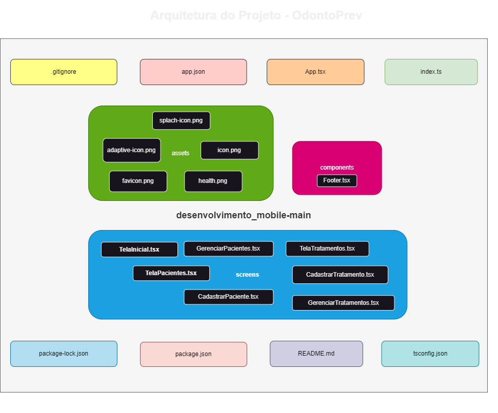

# Desafio OdontoPrev

## Grupo:
- Giovanna Lima - RM553369
- Lorenzo Vaz - RM553941
- Rebeca Lopes - RM553764

## Sobre o Projeto:
OdontoSmart é um aplicativo mobile desenvolvido para ajudar dentistas e profissionais de saúde bucal a gerenciar informações sobre pacientes, tratamentos e recomendações odontológicas. O objetivo do projeto é reduzir custos, aumentar a eficiência e melhorar a experiência dos pacientes.

## Tecnologias Utilizadas:
- React Native (Expo)
- TypeScript
- React Navigation
- Banco de dados (futuro)

## Funcionalidades:
-  Cadastro de Pacientes
-  Cadastro de Tratamentos
-  Listagem de Pacientes e Tratamentos
-  Navegação Intuitiva
-  Design Responsivo

## Como Rodar o Projeto:
1. Clone o repositório (git clone https://github.com/rebecalopes822/mob3entrega.git)

2. Entre na pasta do projeto (cd odontoprev)

3. Instale as dependências (npm install)

4. Inicie o Expo (npx expo start)

## Arquitetura do Projeto
Abaixo está o diagrama representando a estrutura de pastas e arquivos do projeto:

